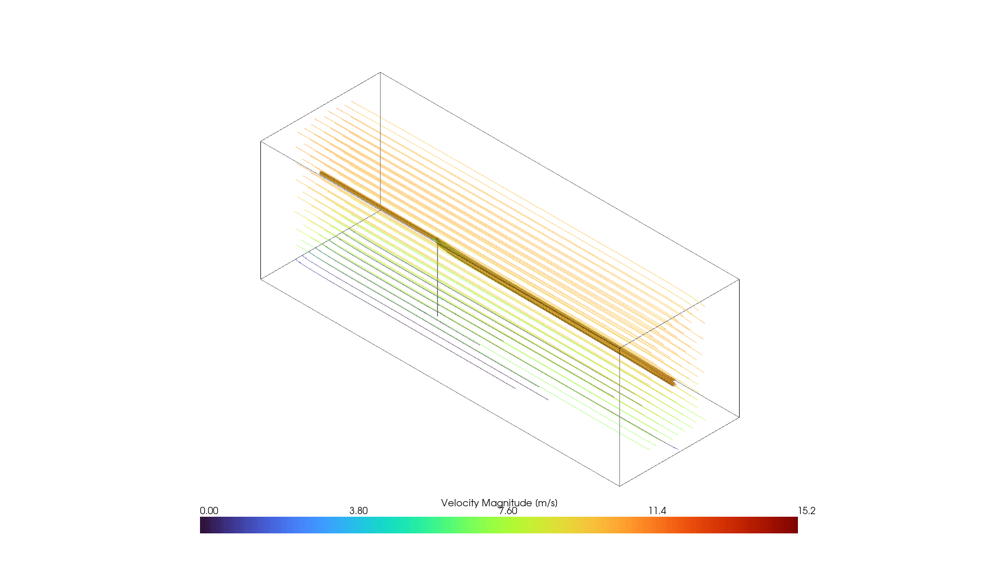
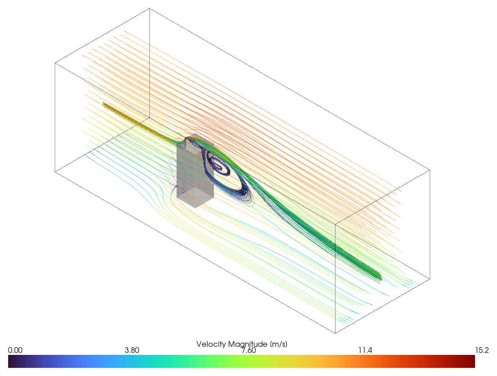
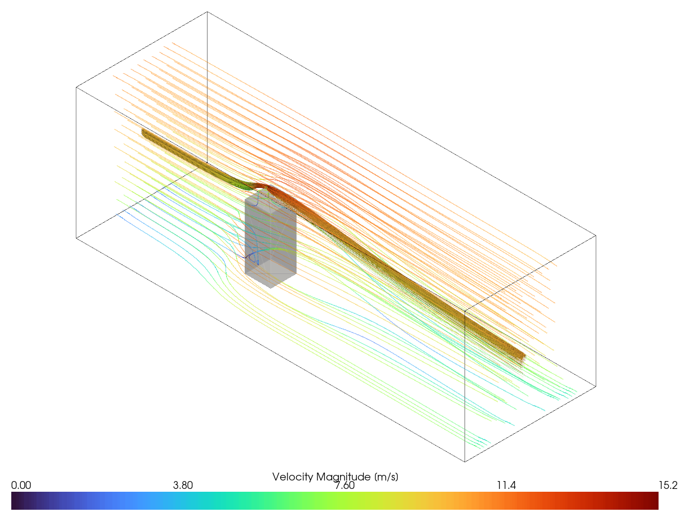

# CFD Analysis of Rooftop Wind Turbine Siting

M.Sc. thesis project (Environmental Protection Engineering, Warsaw University of Technology) — a full CFD pipeline built from scratch to evaluate how much usable wind power a small vertical-axis wind turbine (H-Darrieus) actually captures depending on where it is mounted on a building rooftop.

## Motivation

Small rooftop wind turbines are often marketed as a way to add renewable generation to existing buildings, but the wind resource right above a roof is heavily disturbed by the building itself. This project quantifies that disturbance with CFD instead of relying on generic wind-resource assumptions, comparing two candidate turbine mounting heights on the same building against an open-terrain baseline with no building present.

## Results

Three scenarios were simulated: an open-terrain baseline (no building), a **low-pole** siting where the turbine sits within the roof-edge separation bubble, and a **high-pole** siting (~7 m higher) where it sits in the accelerated shear layer above the windward roof edge.

| Scenario | Hub height [m] | Mean wind speed at rotor [m/s] | Available power density [W/m²] | Relative to baseline |
|---|---|---|---|---|
| Baseline (no building) | 105.05 | 7.51 | 259.3 | 100% |
| Low pole (wake) | 105.05 | 2.02 | 5.0 | **1.9%** |
| High pole (speed-up) | 112.10 | 9.38 | 505.8 | **195%** |

The low-pole site — structurally the more convenient position — loses over 98% of the open-terrain resource by sitting inside the building's roof-separation bubble. Moving the same turbine ~7 m higher, into the roof-edge acceleration zone, nearly **doubles** the open-terrain resource instead: a **~100-fold** difference in available power density between the two building-mounted options, confirmed against mesh-related uncertainty (a 3-level grid convergence study: 182,298 / 561,061 / 2,324,696 cells) that was propagated through the result and found too small to change the ranking.

Converting available power density to an indicative captured-power estimate (literature $C_p \in [0.25, 0.35]$ for this rotor class) puts the high-pole site's output in the range of a small commercial H-Darrieus unit (~1.8–2.5 kW) with a simple payback of ~22–48 years at representative small-wind market figures — long, but finite. The low-pole site's indicative output (tens of watts) does not pay back within any realistic turbine service life under the same assumptions.

The three streamline renders below show why: the baseline flow is undisturbed, the low-pole turbine sits in a recirculating, partly reversed-flow bubble directly on the roof, and the high-pole turbine sits in the accelerated flow streaming over the windward roof edge.

| Baseline | Low pole (wake) | High pole (speed-up) |
|---|---|---|
|  |  |  |

`results/` also includes the kinematic pressure field and roof-edge turbulence intensity (both low-pole scenario, explaining *why* the two sitings differ physically), a close-up of the low-pole recirculation structure, and the coarse/medium/fine mesh comparison behind the grid convergence study.

## Pipeline / tech stack

| Stage | Tool |
|---|---|
| Geometry (building, pole, turbine) | FreeCAD |
| Meshing (background + snappyHexMesh) | Gmsh, OpenFOAM `blockMesh` / `snappyHexMesh` |
| Solver | OpenFOAM (`simpleFoam`, steady RANS), built from source and containerized in Docker |
| Post-processing & visualization | Python (PyVista), ParaView |
| Automation | Bash / Batch / PowerShell mesh-generation scripts, Python comparison scripts |

The whole pipeline — geometry → mesh → solve → post-process — is scripted rather than driven by hand through GUIs, which is what made it practical to re-run for 3 siting scenarios and 3 mesh resolutions.

## Repository contents

This repo contains the **authored source** behind the study — scripts and case configuration — not the multi-gigabyte solved simulation output (mesh + field data), which isn't practical or useful to version in git.

```
scripts/
  generate.py          # PyVista post-processing: renders velocity/vorticity fields,
                        # streamlines and geometry context from solved VTK output
  pvScriptMesh.py       # ParaView automation for mesh visualization
  mesh_comparison.py    # Builds the 3-way coarse/medium/fine mesh comparison figure
                        # used in the grid convergence study
  Allmesh / .bat / .ps1 # End-to-end mesh generation (blockMesh -> surface feature
                        # extraction -> snappyHexMesh), cross-platform

docker/
  openfoam-docker        # Official OpenCFD run script for the OpenFOAM Docker image

case/
  system/                # Solver, mesh and numerical scheme configuration
                          # (controlDict, fvSchemes, fvSolution, snappyHexMeshDict, ...)
  constant/triSurface/    # Input CAD geometry (turbine, pole, building/tunnel walls)
  0/                      # Initial and boundary conditions (U, p, k, omega, nut)

results/
  full_scene_analysis_nobuilding.png             # Baseline streamlines (no building)
  full_scene_analysis.png                        # Low-pole streamlines (roof-separation bubble)
  full_scene_analysis_longpole.png               # High-pole streamlines (roof-edge speed-up)
  refined_zone_subset_only_nobuilding.png        # Baseline close-up, refined mesh region
  pressure_field.png                             # Kinematic pressure field (low-pole scenario)
  turbulence_intensity_roof.png                  # Turbulence intensity near the windward roof edge
  mesh_coarse_closeup.png / _medium_ / _fine_    # Grid convergence study mesh comparison
  geometry_turbine_only_nobuilding.png           # Turbine/pole geometry render
  geometry_pole_turbine_closeup_nobuilding.png   # Turbine/pole geometry close-up
```

Not included: solved field data, generated volume meshes (`constant/polyMesh`), simulation logs, and the OpenFOAM source tree itself (built separately from [openfoam.com](https://www.openfoam.com/)) — these are either regenerable from the scripts/config above, or not authored by me.

## Running it

1. Build/pull OpenFOAM (this project used OpenFOAM v2406) — natively or via `docker/openfoam-docker`.
2. From inside `case/`, run `../scripts/Allmesh` to generate the mesh.
3. Run the solver (`simpleFoam`) to steady-state convergence.
4. Use `scripts/generate.py` / `scripts/pvScriptMesh.py` to render results from the solved VTK output.

## Author

Teodor Noga — [linkedin.com/in/teodor-noga-5a58231a9](https://www.linkedin.com/in/teodor-noga-5a58231a9)
